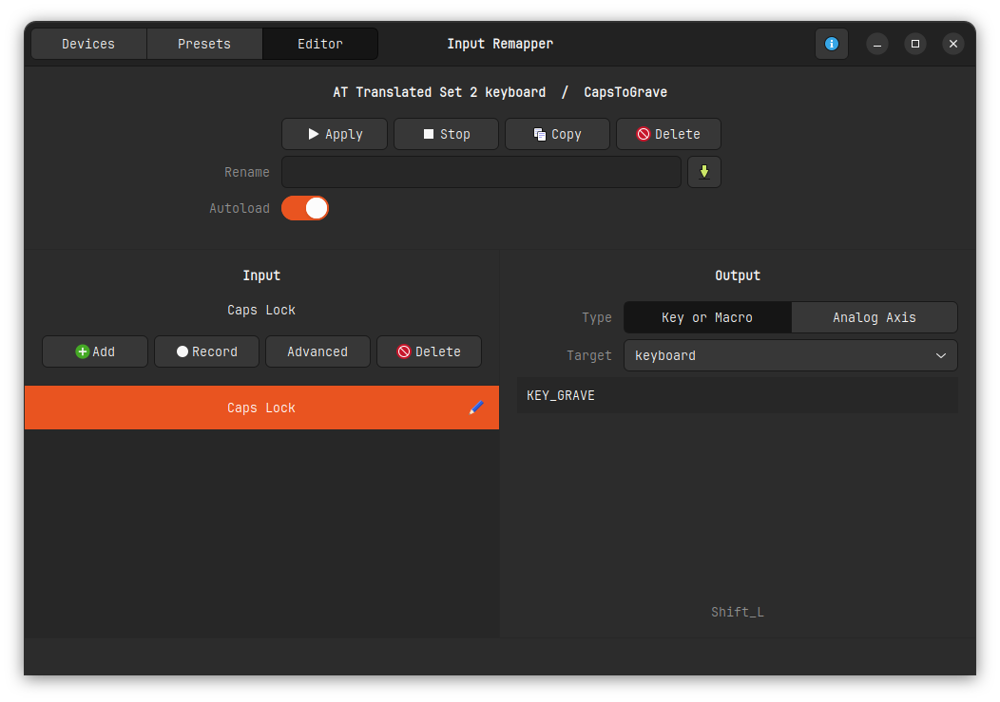

# Dotfile configurations

## Installing the environment

```bash
sudo sh -c "$(curl -fsLS get.chezmoi.io)" -- -b /usr/local/bin
```

```bash
chezmoi init --apply e-radu
```

```bash
cd ~/.config
```

```bash
source setup.sh
```

```bash
source tools.sh
```

```bash
source gui_setup.sh
```

## Mapping CapsLock to Grave key (`)

1. Install Input Remapper using the setup.sh script
2. Set capslock to Grave key as in the image below

